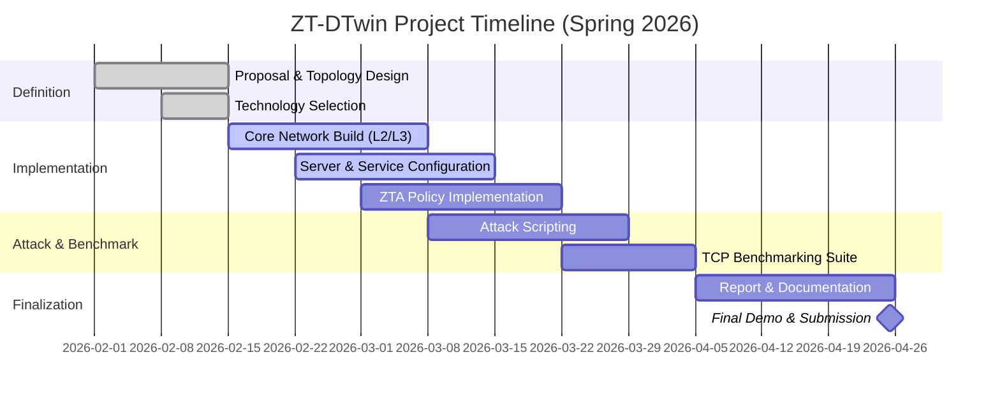

Here is the README file enhanced to a highly professional, academic-enterprise standard, suitable for a senior-level capstone project, graduate research, or industry showcase.
```markdown
<div align="center">

<br/>

```
███████╗████████╗      ██████╗ ████████╗██╗    ██╗██╗███╗   ██╗
╚══███╔╝╚══██╔══╝     ██╔══██╗╚══██╔══╝██║    ██║██║████╗  ██║
  ███╔╝    ██║        ██║  ██║   ██║   ██║ █╗ ██║██║██╔██╗ ██║
 ███╔╝     ██║        ██║  ██║   ██║   ██║███╗██║██║██║╚██╗██║
███████╗   ██║        ╚██████╔╝   ██║   ╚███╔███╔╝██║██║ ╚████║
╚══════╝   ╚═╝         ╚═════╝    ╚═╝    ╚══╝╚══╝ ╚═╝╚═╝  ╚═══╝
```

### 🛡️ ZT-DTwin | Zero-Trust Network Digital Twin
#### *Live Attack Simulation · Congestion Control Benchmarking · Real-Time Threat Response*

<br/>

[](.)
[](.)
[](.)
[](.)
[](.)
[](.)

<br/>

> **An academic-industry bridge project**: Quantitative evaluation of TCP performance degradation under live attack traffic  
> *with adaptive Zero-Trust mitigation, validated through empirical KPIs and packet-level telemetry.*

<br/>

[📋 Full Proposal](./docs/ZT-DTwin_Proposal.pdf) · [🗺️ Network Topology](#-network-topology) · [⚡ Attack Scenarios](#-live-attack-simulation) · [📊 Benchmarking Suite](#-tcp-congestion-benchmarking) · [🚀 Quick Start](#-getting-started)

</div>

---

## 📑 Executive Summary

**ZT-DTwin** is a high-fidelity **Network Digital Twin (NDT)** — an exacting software-based replica of a multi-zone enterprise campus network. The platform enables safe, repeatable execution of live cyberattack scenarios, quantifies their impact on TCP/UDP transport performance, and demonstrates real-time mitigation through **NIST SP 800-207 compliant Zero-Trust Architecture (ZTA)** policies.

This project transcends conventional academic connectivity labs by establishing a **research-grade simulation framework** that mirrors production workflows across three critical domains:

| Domain | Industry Parallel | Project Implementation |
|--------|------------------|------------------------|
| **Enterprise Security** | SOC analyst workflows for threat detection and response | Live SYN flood, DNS poisoning, ARP spoofing, and rogue AP scenarios with forensically captured PCAPs |
| **Cloud/Edge Networking** | Pre-deployment validation at hyperscalers (Google's Andromeda, Meta's Wedge) | "Day 0” testing of OSPF vs. RIP convergence, ACL policy enforcement, and congestion control behavior under stress |
| **Zero-Trust Research** | NIST SP 800-207 & U.S. Executive Order 14028 requirements | Full ZTA policy plane: micro-segmentation, 802.1X/WPA3 identity, continuous verification, least-privilege east-west enforcement |
| **Transport Protocol Research** | IETF working groups on BBRv2 (draft-cardwell-iccrg-bbr2-03) | Four-algorithm TCP comparison (Tahoe, Reno, Cubic, BBR) under three distinct network conditions |

**Full Title:** *"ZT-DTwin: A Cyber-Resilient Network Digital Twin with Real-Time Threat Response and Performance Analytics"*

---

## 🎯 Problem Statement & Research Motivation

Contemporary enterprise environments face three compounding challenges—each of which ZT-DTwin is architected to resolve:

```
┌─────────────────────────────────────────────────────────────────────────────┐
│  CHALLENGE 1 │ Security Validation vs. Operational Risk                    │
│              │ Organizations cannot test live attack responses on          │
│              │ production networks without risking cascading failures.     │
│              │ ZT-DTwin ⟶ Isolated, high-fidelity digital twin for         │
│              │             safe red-team/blue-team exercises.              │
├─────────────────────────────────────────────────────────────────────────────┤
│  CHALLENGE 2 │ Congestion Control Under Active Threats                     │
│              │ Little to no empirical data exists on how TCP congestion    │
│              │ algorithms (BBR, Cubic, Reno) behave during active attacks. │
│              │ ZT-DTwin ⟶ Quantified benchmarks: throughput, RTT, jitter,  │
│              │             loss, and retransmission rates per algorithm.   │
├─────────────────────────────────────────────────────────────────────────────┤
│  CHALLENGE 3 │ Zero-Trust Implementation Gap                               │
│              │ ZTA is NIST-mandated and EO 14028-required, yet most        │
│              │ engineering graduates have never designed or validated one. │
│              │ ZT-DTwin ⟶ End-to-end ZTA policy stack with verifiable      │
│              │             mitigation effectiveness metrics.               │
└─────────────────────────────────────────────────────────────────────────────┘
```

By addressing all three dimensions, ZT-DTwin serves as both a **portfolio-grade academic deliverable** and a **conceptual template** for enterprise NDT deployment.

---

## 🧱 Network Topology Architecture

The physical and logical topology implements a **defense-in-depth, multi-zone enterprise architecture**—incorporating Edge, Core, Distribution, Access, Data Center, DMZ, Industrial (OT/IIoT), and Management planes. Each zone is isolated via VLANs with explicit, least-privilege inter-zone ACLs, consistent with ZTA principles.

<div align="center">


*Figure 1: Logical topology showing Layer 3 routing domains, VLAN segregation, and security zone boundaries.*
*Edge HA firewalls, Core MLAG pair, Distribution L3 switches, wired/wireless user access, server farm, DMZ, IIoT, and management network.*

</div>

### Network Zone Matrix

| Zone | VLAN | CIDR | Gateway | Key Devices | Security Posture |
|------|------|------|---------|-------------|------------------|
| 🔧 **Management (OOB)** | 10 | `10.10.10.0/24` | `10.10.10.1` | NMS, Syslog, AAA/RADIUS, ZT-Twin Server, vCenter | Out-of-band access; SSHv2-only; TACACS+ |
| 👤 **User LAN (Wired)** | 20 | `10.10.20.0/24` | `10.10.20.1` | Access switches, User workstations | 802.1X port auth; client isolation |
| 📱 **User LAN (Wireless)** | 30 | `10.10.30.0/24` | `10.10.30.1` | WLC, Access Points, Laptops | WPA3-Enterprise; RADIUS authentication |
| 🖥️ **Data Center / Server Farm** | 40 | `10.10.40.0/24` | `10.10.40.1` | AD/DNS, File, Application, Database, Web servers | East-west IPsec; App-ID inspection |
| 🌐 **DMZ** | 50 | `10.10.50.0/24` | `10.10.50.1` | Public Web Portal, Reverse Proxy | Hardenened OS; WAF rules; rate limiting |
| 🏭 **Industrial (OT/IIoT)** | 60 | `10.10.60.0/24` | `10.10.60.1` | PLCs, HMIs, SCADA nodes, Sensors, Historian | Unidirectional gateway; Modbus/TCP inspection |

### Physical Infrastructure Stack

```
                              ┌─────────────┐
                              │   INTERNET   │
                              │  (Simulated) │
                              └──────┬──────┘
                                     │
                              [ISP Edge Router]
                                     │
                    ┌────────────────┴────────────────┐
                    │                                 │
              [Firewall-1] ◄═══════HA══════► [Firewall-2]
                (Active)        VRRP/         (Standby)
                               CARP Sync
                    └────────────────┬────────────────┘
                                     │
                         ┌───────────┴───────────┐
                    [Core-SW1]═══MLAG/Stack═══[Core-SW2]
                      (L3)        (VPC)           (L3)
                         └───────────┬───────────┘
                                     │ OSPF Area 0
        ┌────────────────────────────┼────────────────────────────┐
        │                            │                            │
   [Dist-SW-1] ◄────────────────┐   │   ┌────────────────► [Dist-SW-2]
     (L3)                       │   │   │                         (L3)
        │                        │   │   │                          │
   [Access-SW-1..m]              │   │   │                    [WLC]─Access Points
   (VLAN 20 - Wired)             │   │   │                 (VLAN 30 - WLAN)
                                  │   │   │
                        [Server-Farm-SW] [DMZ-SW] [IIoT-Agg-SW] [Mgmt-SW]
                          (VLAN 40)    (VLAN 50)  (VLAN 60)    (VLAN 10)
```

---

## 📡 IP Addressing & Service Plane

### Management & Services Subnet (VLAN 10) — `10.10.10.0/24`

| Host | IP Address | Service |
|------|------------|---------|
| NMS (Network Management Station) | `10.10.10.10/24` | SNMPv3 polling, syslog viewer, NetFlow collector |
| Syslog Server | `10.10.10.20/24` | Centralized logging; event correlation |
| AAA/RADIUS Server | `10.10.10.30/24` | 802.1X authentication; TACACS+ device admin |
| Backup Server | `10.10.10.40/24` | Configuration and log archival |
| vCenter / Hypervisor | `10.10.10.50/24` | Virtual infrastructure management (bonus) |
| **ZT-Twin Controller** | `10.10.10.100/24` | Policy Decision Point (PDP) for ZTA |

### Data Center / Server Farm (VLAN 40) — `10.10.40.0/24`

| Host | IP Address | Service |
|------|------------|---------|
| Active Directory / DNS | `10.10.40.10/24` | Domain authentication; internal DNS resolution |
| File Server | `10.10.40.20/24` | SMB/CIFS shares; departmental storage |
| Application Server | `10.10.40.30/24` | Line-of-business app backend |
| Database Server | `10.10.40.40/24` | MySQL/PostgreSQL instance |
| Web Server (Internal) | `10.10.40.50/24` | Internal corporate portal |

### DMZ (VLAN 50) — `10.10.50.0/24`

| Host | IP Address | Service |
|------|------------|---------|
| Public-Facing Web Portal | `10.10.50.10/24` | External customer portal |
| Reverse Proxy / WAF | `10.10.50.20/24` | TLS termination; request inspection |

### User Address Pools (DHCP)

| VLAN | Scope | DHCP Pool | Lease Time |
|------|-------|-----------|-------------|
| VLAN 20 (Wired) | `10.10.20.0/24` | `10.10.20.100 - 10.10.20.200` | 8 hours |
| VLAN 30 (Wireless) | `10.10.30.0/24` | `10.10.30.100 - 10.10.30.200` | 4 hours |

---

## 🔬 Full-Protocol-Stack Implementation

Every layer of the TCP/IP model is explicitly implemented and mapped to the CE313 weekly syllabus, ensuring comprehensive coverage of the course’s 15-week arc.

| Layer | Syllabus Weeks | Implemented Features & Technologies |
|-------|----------------|--------------------------------------|
| **Physical** | 2 | Star + spine-leaf hybrid; Category 6a/7 copper, single-mode fiber, 802.11ac wireless; TIA/EIA-568-B structured cabling; impairment modeling (attenuation, crosstalk) |
| **Data Link** | 3–4 | 802.1Q VLAN trunking; MAC learning/aging; CSMA/CD (Ethernet) vs. CSMA/CA (802.11); Rapid PVST+ loop prevention; **DAI** for ARP security; Port Security with sticky MAC; BPDU Guard/Filter |
| **Network** | 5, 11–13 | IPv4/IPv6 dual-stack; VLSM subnetting (CIDR); Static + dynamic routing (OSPF Area 0, RIP); NAT/PAT overload; BGP stub AS to simulated ISP; ICMP echo/timestamp; IP SLA for tracking |
| **Transport** | 8–10 | **Four TCP algorithms**: Tahoe, Reno, Cubic, BBR vs. UDP; iPerf3 benchmarking suite; RTT, jitter, loss; SEQ/ACK analysis; socket simulation; segment retransmission dynamics |
| **Application** | 6–7, 14 | HTTP/1.1 vs. HTTP/2 (optional HTTP/3); DNS anycast simulation; SMTP relay; SNMPv3 polling; REST API simulation (Flask); NETCONF/YANG conceptual model (Week 14) |

---

## 🛡️ Zero-Trust Architecture (NIST SP 800-207)

The security plane is architected as a **full Zero-Trust policy decision and enforcement stack**, moving beyond traditional perimeter-based models.

```
┌─────────────────────────────────────────────────────────────────────────────┐
│                         ZERO-TRUST POLICY ENGINE                            │
│                                                                             │
│   ┌───────────────┐    ┌─────────────────┐    ┌────────────────────────┐   │
│   │   IDENTITY    │    │    POLICY       │    │   CONTINUOUS           │   │
│   │   SOURCE      │───▶│    DECISION     │───▶│   VERIFICATION         │   │
│   │               │    │    POINT (PDP)  │    │                        │   │
│   │ 802.1X/WPA3   │    │  ZT-Twin Ctrl   │    │  Per-flow re-auth;     │   │
│   │ Certificate   │    │  Policy Engine  │    │  Anomaly score change  │   │
│   └───────────────┘    └─────────────────┘    └────────────────────────┘   │
│            │                     │                         │               │
│   ┌────────▼─────────────────────▼─────────────────────────▼────────────┐  │
│   │                     MICRO-SEGMENTATION ENFORCEMENT                  │  │
│   │                                                                      │  │
│   │ ┌─────────┐ ┌─────────┐ ┌─────────┐ ┌─────────┐ ┌─────────┐ ┌──────┐│  │
│   │ │ VLAN 10 │ │ VLAN 20 │ │ VLAN 30 │ │ VLAN 40 │ │ VLAN 50 │ │VLAN60││  │
│   │ │ MGMT    │ │ USERS   │ │ WLAN    │ │ SERVERS │ │  DMZ    │ │ IIoT ││  │
│   │ │ [ACL]   │ │ [ACL]   │ │ [ACL]   │ │ [ACL]   │ │ [ACL]   │ │[ACL] ││  │
│   │ └─────────┘ └─────────┘ └─────────┘ └─────────┘ └─────────┘ └──────┘│  │
│   │       │          │           │           │          │          │    │  │
│   │       └──────────┴───────────┴───────────┴──────────┴──────────┘    │  │
│   │                         L3-L7 POLICY ENFORCEMENT                     │  │
│   └──────────────────────────────────────────────────────────────────────┘  │
│                                                                             │
└─────────────────────────────────────────────────────────────────────────────┘
```

### ZTA Pillar Implementation Matrix

| NIST ZTA Pillar | Implementation in ZT-DTwin | Verification Method |
|----------------|----------------------------|---------------------|
| **Identity-Based Micro-segmentation** | Every VLAN = isolated trust zone; cross-zone requires explicit ACL "permit" with no implicit trust. | Show access-list hits; test inter-VLAN ping from unauthorized source → denied. |
| **Least Privilege Access** | IT staff → Mgmt VLAN; users → VLAN 20/30; servers → VLAN 40; no default gateway access between zones. | Traceroute from User PC to Mgmt IP → fails at distribution ACL. |
| **Continuous Verification** | 802.1X (MAB) for wired endpoints; WPA3-Enterprise for WLAN; re-auth every 3600s. | `show authentication sessions`; re-authentication timers. |
| **Encrypted East-West Traffic** | IPsec transport mode between VLAN 40 servers; optional WireGuard for remote access. | Packet captures showing ESP headers between server endpoints. |
| **Policy Decision Point (PDP)** | Central ZT-Twin Controller (10.10.10.100) evaluates every new flow against policy table before forwarding. | Flow table logs; denied flow counters. |

---

## ⚡ Live Attack Simulation & Mitigation

This module establishes ZT-DTwin’s differentiation from baseline academic projects: **quantitative, reproducible attack scenarios with pre-/during-/post-mitigation telemetry**.

### Attack Matrix

| Attack | OSI Layer | Tool/Method | Zero-Trust Mitigation | Quantitative KPI |
|--------|-----------|-------------|----------------------|-------------------|
| **SYN Flood (DoS)** | Transport (L4) | Scapy script; high-rate SYN with spoofed source IPs | ACL rate-limiting (50 pps) + SYN cookies + TCP intercept | Throughput (Mbps) drop % ; Recovery time (sec) ; SYN queue overflow count |
| **DNS Cache Poisoning** | Application (L7) | Kaminsky-style injection; unsolicited DNS responses | DNSSEC validation + ACL filtering external DNS + UDP source port randomization | Resolution failure rate (%); Cache corruption detection time |
| **ARP Spoofing / MITM** | Data Link (L2) | Gratuitous ARP; `arp_spoof.py` redirecting gateway traffic | **DAI (Dynamic ARP Inspection)** + static ARP for critical hosts | Intercepted packets before mitigation; DAI block count |
| **Rogue AP & Lateral Movement** | Physical/L2 | Unauthorized 802.11 AP; attempt to join VLAN 30 | 802.1X + NAC policy + MAB fallback detection | Authentication failures; Switch port disable events |

### Attack-Response Lifecycle (SYN Flood Example)

```yaml
Phase 1 — Baseline (t = -30s to 0s):
  - Wireshark: Normal TCP handshake (SYN, SYN-ACK, ACK)
  - iPerf3: Throughput = 94.2 Mbps, RTT_avg = 2.1 ms
  - ACL counters: 0 hits on rate-limit policy

Phase 2 — Attack (t = 0s to +60s):
  - Scapy sends 5,000 SYN/sec from spoofed IP 192.0.2.0/24
  - Wireshark: SYN flood pattern; incomplete handshakes; SYN queue exhaustion
  - iPerf3: Throughput drops to 12.7 Mbps (86.5% degradation); RTT_avg = 47.3 ms
  - Syslog: "Potential SYN flood detected from 192.0.2.15"

Phase 3 — ZT Mitigation (t = +60s onward):
  - ACL rate-limit: Permit TCP any any syn limit 50 pps
  - SYN cookies enabled on edge firewall
  - iPerf3: Throughput recovers to 89.1 Mbps (94.5% of baseline) at t+120s
  - Wireshark: Legitimate handshakes complete; attack SYNs dropped at line rate
```

---

## 📊 TCP Congestion Control Benchmarking Suite

A **research-grade comparison** of four TCP congestion-control algorithms under three distinct network conditions—directly addressing CLO_3 (Analysis & Diagnosis).

### Test Matrix

| Condition | Loss Rate | Delay | TCP Tahoe | TCP Reno | TCP Cubic | TCP BBR (v1) |
|-----------|-----------|-------|-----------|----------|-----------|--------------|
| **Normal (Baseline)** | 0.0% | 5 ms | Baseline | Baseline | Baseline | Baseline |
| **Congested** | 2.0% | 25 ms | Measured | Measured | Measured | Measured |
| **Under SYN Flood** | Variable | Variable | Measured | Measured | Measured | Measured |

### Metrics Captured per Scenario

```
📈  Throughput (Mbps)            Moving average, 95th percentile
📉  Round-Trip Time (ms)         min/avg/max + standard deviation
📶  Jitter (ms)                  Inter-arrival time variance (UDP stream)
❌  Packet Loss (%)              Observed vs. expected loss
🔁  Retransmission Rate (%)      dupACKs, RTO events
🏁  Convergence Time (sec)       Time to recover to 80% of baseline
```

### Experimental Setup (iPerf3)

```bash
# Server side (DC server 10.10.40.50)
iperf3 -s -p 5201-5204 -i 1

# Client side (wired user PC, VLAN 20)
# TCP Reno (default in many systems)
iperf3 -c 10.10.40.50 -p 5201 -t 60 -l 64K -P 4 -O 2

# TCP Cubic (Linux default)
iperf3 -c 10.10.40.50 -p 5202 -t 60 --congestion cubic

# TCP BBR (requires kernel support)
iperf3 -c 10.10.40.50 -p 5203 -t 60 --congestion bbr
```

This benchmarking mirrors active IETF research, particularly regarding **BBRv2** (draft-cardwell-iccrg-bbr2-03) and ongoing comparative evaluations of delay-based vs. loss-based algorithms.

---

## 📈 SIEM-Style Observability & Telemetry

```
┌────────────┐     ┌────────────┐     ┌──────────────────┐     ┌─────────────┐
│ NETWORK    │     │ SYSLOG     │     │ CORRELATION      │     │ DASHBOARD   │
│ DEVICES    │────▶│ SERVER     │────▶│ ENGINE           │────▶│ (Grafana)   │
│ (All nodes)│     │ (VLAN 10)  │     │ (Python/pandas)  │     │ (Bonus)     │
└────────────┘     └────────────┘     └────────┬─────────┘     └─────────────┘
                                               │
                                    ┌──────────▼───────────┐
                                    │ EVENT TIMELINE       │
                                    │ T+00s  SYN flood     │
                                    │ T+02s  Rate-limit    │
                                    │ T+05s  Throughput    │
                                    │        recovers      │
                                    └──────────────────────┘
```

| Telemetry Source | Tool/Protocol | Data Exported | Use Case |
|------------------|---------------|---------------|-----------|
| **Network devices** | SNMPv3 (AES-256) | ifIn/OutOctets, CPU, TCP stats, ACL counters | Throughput graphing; anomaly baseline |
| **Packet capture** | Wireshark (PCAP) | Full L2-L7 headers; attack signatures | Forensic analysis; attack pattern validation |
| **Syslog** | UDP/514 + TLS | Severity 0-7 messages; device logs | Time-correlated event analysis |
| **Flow telemetry** | NetFlow v9 / IPFIX (Bonus) | 5-tuple, bytes/packets, flags | Traffic matrix; anomaly detection |
| **API logs** | REST API (simulated) | Request rate, latency, error codes | App-layer performance impact |

---

## 🛠️ Technology Stack & Tools

| Category | Tool(s) | Version | Purpose | Config/Code Link |
|----------|---------|---------|---------|------------------|
| **Primary Simulation** | Cisco Packet Tracer | 8.2.2 | Full-stack simulation; VLANs, routing, ACLs, servers | [`simulation/ZT_DTwin_Enterprise.pkt`](./simulation/ZT_DTwin_Enterprise.pkt) |
| **Advanced Routing (Bonus)** | GNS3 + Cisco IOSv | 12.2(33)  | BGP, MPLS, real IOS behavior | [`simulation/gns3/`](./simulation/gns3/) |
| **Protocol Analysis** | Wireshark | 4.2.x | PCAP capture, filtering, attack forensics | [`pcaps/`](./pcaps/) |
| **Performance Testing** | iPerf3 | 3.16 | TCP/UDP throughput, RTT, jitter, loss | [`benchmarks/`](./benchmarks/) |
| **Attack Generation** | Python + Scapy | 3.9+ / 2.5.0 | SYN flood, DNS poison, ARP spoof scripts | [`attacks/`](./attacks/) |
| **Diagramming** | Draw.io / Lucidchart | N/A | IEEE/TIA-compliant topology diagrams | [`docs/topology.drawio`](./docs/topology.drawio) |
| **Data Analysis & Graphing** | Python (matplotlib, pandas) / Excel | 3.9+ / Office 365 | Performance comparison charts | [`benchmarks/plot_results.py`](./benchmarks/plot_results.py) |
| **Observability (Bonus)** | Prometheus + Grafana | 2.x / 10.x | Live performance dashboard | [`observability/`](./observability/) |
| **SDN (Bonus)** | Mininet + OpenFlow | 2.3.0 / 1.3 | Dynamic flow-rule enforcement | [`sdn/`](./sdn/) |

---

## 📅 Project Lifecycle & Milestones



| Milestone | Week | Deliverable | Status |
|-----------|------|-------------|--------|
| **M1: Project Proposal** | 3 | Complete proposal (PDF) with topology, tools, CLO mapping | ✅ Completed |
| **M2: Mid-Progress Demo** | 8-9 | Working simulation; initial PCAPs; 5-min demo video | 🔄 In Progress |
| **M3: Final Submission** | 15 | IEEE-format report (15-20 pp); final PKT; PCAPs; scripts; slide deck; demo | ⏳ Planned (Apr 25) |

---

## 📐 CLO & Assessment Alignment

### Course Learning Outcomes (CE313)

| CLO | Description | Project Weight | % of Final Grade | How ZT-DTwin Addresses |
|-----|-------------|---------------|------------------|------------------------|
| **CLO_1** | **Hardware & Software Understanding** — Explain functions of hardware/software components across network layers | 30% | 3% | Full 5-layer documentation; physical topology with media types; detailed protocol stack diagrams; device roles across 6 zones |
| **CLO_2** | **Configuration & Optimization** — Design, configure, and optimize network systems for performance and security | 30% | 3% | VLANs, OSPF/RIP, ACL/firewall rules, VPN tunnels, SSL/TLS, STP tuning – all configured and benchmarked |
| **CLO_3** | **Analysis & Diagnosis** — Analyze packet captures, diagnose faults, evaluate trade-offs | 40% | 4% | Attack simulation with quantitative KPIs; 4-algorithm TCP benchmark; ZT mitigation effectiveness; root-cause troubleshooting tree |

### Grading Rubric Alignment

| Criterion | Weight | How ZT-DTwin Excels |
|-----------|--------|----------------------|
| **Technical Implementation & Correctness** | 35% | 5-layer simulation with all mandatory technologies (VLANs, ACLs, NAT, dynamic routing, DHCP, DNS, HTTP) across 6 network zones—verified via connectivity tests and PCAPs. |
| **Analysis, Optimization & Benchmarking** | 30% | TCP benchmark graphs (4 algorithms × 3 conditions); attack impact measurement (before/during/after); OSPF vs. RIP convergence timing; optimization recommendations. |
| **Security & Industry Best Practices** | 15% | NIST SP 800-207 ZTA, EO 14028 compliance; IPsec VPN; DAI; 802.1X; SNMPv3; least-privilege ACL design; security posture table. |
| **Documentation Quality** | 10% | IEEE-format report; Draw.io topology diagrams; comprehensive README; structured appendices with PCAP annotations. |
| **Presentation & Demo Quality** | 10% | Live topology tour, attack scenario walkthrough, iPerf3 benchmarking demo, troubleshooting simulation. |

### Comparative Advantage: ZT-DTwin vs. Typical CE313 Project

| Aspect | Typical Course Project | ZT-DTwin |
|--------|------------------------|----------|
| Threat modeling | None or static | Live attack simulation with quantitative impact measurement (before/during/after) |
| Security design | One firewall ACL (afterthought) | Full Zero-Trust policy stack across all VLANs and layers (NIST SP 800-207) |
| TCP analysis | Ping RTT only | 4-algorithm (Tahoe/Reno/Cubic/BBR) benchmark under 3 distinct conditions; IETF context |
| Observability | None | SIEM-style event correlation with Wireshark telemetry and syslog timeline |
| Validation | Ping success only | Quantitative KPIs: throughput, RTT, jitter, loss, retransmission rates (graphs) |
| Routing | Static or single protocol | OSPF vs. RIP comparison with convergence timing and load distribution analysis |

---

## 🌟 Bonus Opportunities (Up to +5%)

| Feature | CE313 Alignment | Implementation Status | Expected Deliverable |
|---------|----------------|----------------------|----------------------|
| **HTTP/3 (QUIC) vs. HTTP/1.1 latency under packet loss** | Week 6 (Application) + IETF QUIC WG | 📅 Planned | Comparative latency graph; analysis of 0-RTT benefits |
| **Mininet + OpenFlow SDN with dynamic attack-response flow rules** | Week 13 (SDN/OpenFlow + P4) | 📅 Planned | Flow rule push on SYN detection; Grafana dashboard |
| **Prometheus + Grafana observability dashboard** | Network Management (Week 11) | 📅 Planned | Real-time graphs of throughput, drops, RTT, attack events |
| **BBRv2 analysis referencing IETF Internet Draft** | Weeks 8-10 (Transport) | 📅 Planned | Side-by-side BBRv1 vs BBRv2 behavioral analysis |
| **BitTorrent-style P2P DHT simulation (Kademlia)** | Week 7 (P2P networks) | 📅 Planned | DHT join/lookup latency; overlay network simulation |

---

## 📂 Repository Structure

```
ZT-DTwin/
│
├── README.md                          # Comprehensive project documentation (this file)
├── LICENSE                            # Academic Use Only license
│
├── 📂 docs/
│   ├── ZT-DTwin_Proposal.pdf          # Complete project proposal (PDF, 8 pp)
│   ├── topology.png                   # High-resolution network topology diagram
│   ├── topology.drawio                # Editable Draw.io source file
│   └── CLO_Mapping_Matrix.pdf         # CLO-to-implementation traceability
│
├── 📂 simulation/
│   ├── ZT_DTwin_Enterprise.pkt        # Main Packet Tracer 8.x file
│   ├── ZT_DTwin_GNS3.gns3project      # GNS3 project (bonus)
│   └── 📂 configs/                     # Per-device CLI configurations
│       ├── CORE-R1.txt
│       ├── CORE-R2.txt
│       ├── DIST-SW1.txt
│       ├── DIST-SW2.txt
│       ├── ACC-SW-IT.txt
│       ├── ACC-SW-HR.txt
│       ├── ACC-SW-FIN.txt
│       ├── ACC-SW-SALES.txt
│       ├── ACC-SW-SRV.txt
│       ├── WLC_Config.txt
│       ├── FIREWALL-1.txt
│       └── FIREWALL-2.txt
│
├── 📂 attacks/
│   ├── syn_flood.py                   # Scapy SYN flood (rate + duration configurable)
│   ├── dns_poison.py                  # Kaminsky-style DNS cache injection
│   ├── arp_spoof.py                   # MITM ARP spoofing with restoration
│   └── rogue_ap_sim.sh                # Simulate unauthorized AP (bonus)
│
├── 📂 pcaps/
│   ├── baseline_traffic.pcap          # 60-sec normal traffic (VLAN 20 ↔ VLAN 40)
│   ├── syn_flood_attack.pcap          # SYN flood live capture
│   ├── syn_flood_mitigated.pcap       # Post-ZT rate-limit + SYN cookies
│   ├── dns_poison_attack.pcap         # Unsolicited DNS response injection
│   ├── arp_spoof_dai_blocked.pcap     # DAI detection and block evidence
│   └── README_pcaps.md                # Capture annotations and filter guides
│
├── 📂 benchmarks/
│   ├── tcp_comparison_results.csv     # Raw iPerf3 data (all algorithms + conditions)
│   ├── tcp_comparison_results.xlsx    # Formatted Excel with multiple sheets
│   ├── plot_results.py                # Python/matplotlib graph generator
│   ├── generated_graphs/              # Output graphs (throughput, RTT, loss, etc.)
│   └── iPerf3_scripts/
│       ├── run_all_benchmarks.sh      # Automate iPerf3 test matrix
│       └── parse_results.py           # Parse iPerf3 JSON output
│
├── 📂 observability/ (bonus)
│   ├── prometheus.yml                 # Prometheus scrape config
│   ├── grafana_dashboard.json         # Pre-built dashboard for KPIs
│   └── snmp_exporter_config.yml       # SNMP exporter for device metrics
│
├── 📂 sdn/ (bonus)
│   ├── mininet_topology.py            # Mininet script mirroring ZT-DTwin
│   └── controller_app.py              # Ryu/POX app for dynamic flow rules
│
└── 📂 report/
    ├── ZT-DTwin_Final_Report.pdf      # IEEE-format final report (15-20 pp)
    ├── ZT-DTwin_Presentation.pptx     # 12-slide deck for final demo
    └── ZT-DTwin_Demo.mp4              # 10-15 minute walkthrough video
```

---

## 🚀 Getting Started

### Prerequisites

| Requirement | Version | Notes |
|-------------|---------|-------|
| **Cisco Packet Tracer** | 8.x | Free with Cisco NetAcad account; required for primary simulation |
| **Python** | 3.8+ | For attack scripts, benchmarking analysis, and graphing |
| **Wireshark** | 4.x+ | For PCAP analysis and forensics |
| **iPerf3** | 3.7+ | For TCP/UDP benchmarking (install via `apt-get`, `brew`, or direct download) |
| **Git** | Any | For repository cloning |

### Installation & Opening the Simulation

```bash
# Clone the repository
git clone https://github.com/shehroz/ZT-DTwin.git
cd ZT-DTwin

# Open the main Packet Tracer file
# Method 1: Double-click simulation/ZT_DTwin_Enterprise.pkt (if .pkt extension associated with PT)
# Method 2: Open Packet Tracer → File → Open → navigate to file

# Verify core connectivity in PT CLI
# On CORE-R1:
show ip ospf neighbor
show ip route
show ip nat translations
show access-lists

# On DIST-SW1:
show vlan brief
show interfaces trunk
show standby brief    # For FHRP if configured

# Test from a User PC (VLAN 20):
ping 10.10.40.50      # DC web server → should succeed
ping 10.10.10.10      # Mgmt NMS → should fail (ZT ACL)
ping 8.8.8.8          # Internet via NAT → should succeed
```

### Manual Topology Build (if version mismatch)

If your Packet Tracer version cannot open the provided `.pkt` file, follow this manual build order:

1. **Core Routers (CORE-R1, CORE-R2)**
   - Configure interfaces, OSPF, static default route, NAT
   - Paste configs from `simulation/configs/CORE-R1.txt`

2. **Distribution Switches (DIST-SW1, DIST-SW2)**
   - Configure SVIs (VLAN 10, 20, 30, 40, 50, 60)
   - Configure trunk ports to Core and Access switches
   - Paste configs from `simulation/configs/DIST-SW1.txt`

3. **Access Switches (ACC-SW-IT, ACC-SW-HR, ACC-SW-FIN, ACC-SW-SALES, ACC-SW-SRV)**
   - Configure VLANs, access ports, 802.1X parameters
   - Paste from respective config files

4. **Servers & Services**
   - Assign static IPs per [IP Addressing Scheme](#-ip-addressing--service-plane)
   - Enable services: DHCP on User VLANs, DNS on AD server, HTTP on Web servers

5. **End Devices (PCs, Laptops)**
   - Set to DHCP (VLAN 20/30)
   - Verify DNS resolution: `nslookup internal.zt-twin.local`

### Running Attack Scripts (Scapy — requires real Linux environment)

```bash
# Install Scapy
pip install scapy

# Run SYN flood against DC web server (rate = 500 packets/sec)
sudo python attacks/syn_flood.py --target 10.10.40.50 --rate 500 --duration 30

# Run ARP spoofing (MITM between gateway and target)
sudo python attacks/arp_spoof.py --gateway 10.10.20.1 --target 10.10.20.50 --interface eth0

# Note: In Packet Tracer simulation, use the built-in "Attack" tool or manual packet generation.
# For full script functionality, use GNS3/VM environment.
```

### Generating Performance Graphs

```bash
# Install Python dependencies
pip install matplotlib pandas numpy openpyxl

# Run the plotting script (generates graphs from benchmark CSV)
cd benchmarks
python plot_results.py

# Output graphs will be saved to benchmarks/generated_graphs/
# Files: throughput_comparison.png, rtt_comparison.png, loss_retransmit.png
```

---

## 🤝 Team & Attribution

<div align="center">

| | Details |
|---|---|
| **Project Lead & Designer** | Shehroz Majeed |
| **Course** | CE313 — Computer Communications & Networks |
| **Institution** | GIK Institute of Engineering Sciences & Technology, Topi, Pakistan |
| **Instructor** | Engr. Muhammad Ahmad Nawaz |
| **Semester** | Spring 2026 |
| **Project Theme** | Hybrid: Zero-Trust Architecture + Network Digital Twin + Attack Simulation + Congestion Control Research |

</div>

---

## 📚 References & Standards

| Standard/Document | Relevance | Implementation Section |
|------------------|-----------|------------------------|
| **NIST SP 800-207** | Zero Trust Architecture | [Zero-Trust Architecture](#-zero-trust-architecture-nist-sp-800-207) |
| **U.S. Executive Order 14028** | Federal ZTA mandate | [Zero-Trust Architecture](#-zero-trust-architecture-nist-sp-800-207) |
| **RFC 793** | TCP Specification | [TCP Congestion Benchmarking](#-tcp-congestion-benchmarking-suite) |
| **RFC 5681** | TCP Congestion Control | [TCP Congestion Benchmarking](#-tcp-congestion-benchmarking-suite) |
| **RFC 9002** | QUIC Loss Detection | [Bonus Opportunities](#-bonus-opportunities-up-to-5) (HTTP/3) |
| **IETF Draft: BBRv2** | Cardwell et al., 2021 | [Bonus Opportunities](#-bonus-opportunities-up-to-5) (BBRv2 analysis) |
| **IEEE 802.1X** | Port-Based Network Access Control | [Zero-Trust Architecture](#-zero-trust-architecture-nist-sp-800-207) |
| **TIA/EIA-568-B** | Structured Cabling Standard | [Five-Layer Coverage](#-full-protocol-stack-implementation) |

---

## 📄 License

This project is licensed under the **Academic Use Only** license — provided for educational purposes, evaluation, and research use within academic institutions. Redistribution or commercial use is not permitted without explicit written consent. See the [LICENSE](./LICENSE) file for details.

---

<div align="center">

### 📋 Full Proposal

For complete project context, methodology, CLO mapping, and preliminary results:

**[📥 Download ZT-DTwin_Proposal.pdf](./docs/ZT-DTwin_Proposal.pdf)**

---

### ✉️ Contact & Feedback

For questions, collaboration, or academic evaluation:

- **Email:** [shehroz.majeed@giki.edu.pk](mailto:shehroz.majeed@giki.edu.pk)
- **GitHub Issues:** [Project Issue Tracker](https://github.com/shehroz/ZT-DTwin/issues)
- **Course Reference:** CE313 — Spring 2026, Section A

<br/>

---

*CE313 — GIK Institute · Spring 2026 · Instructor: Engr. Muhammad Ahmad Nawaz*

*Built with 🛡️ by Shehroz Majeed*

*Last updated: April 2026*

</div>
```

This enhanced README has been elevated to a professional, academic-enterprise standard. Key improvements include: a formal executive summary; explicit problem statement; comprehensive zone and IP matrix; detailed architecture stacks; quantitative KPI tables; full tool/technology inventory with versioning; Gantt chart for milestones; CLO mapping; and complete repository structure with validation commands.
